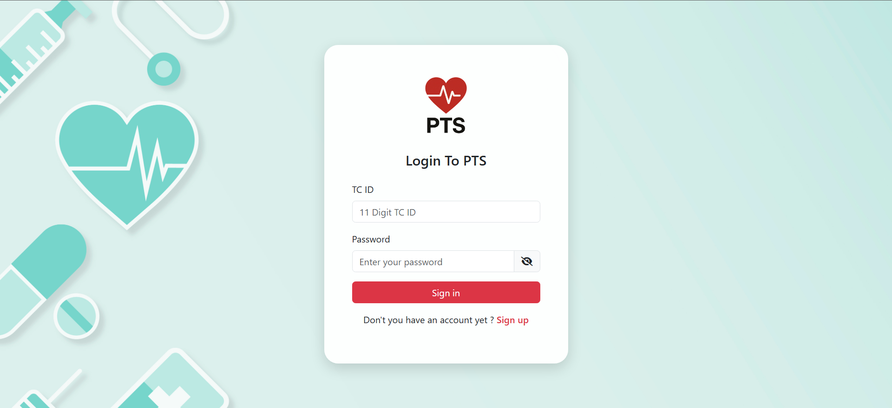
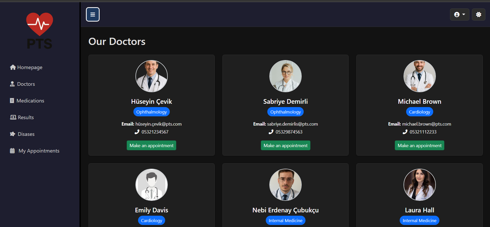
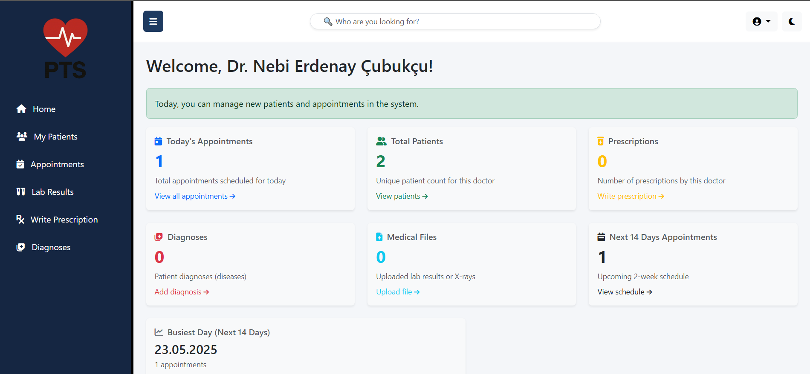
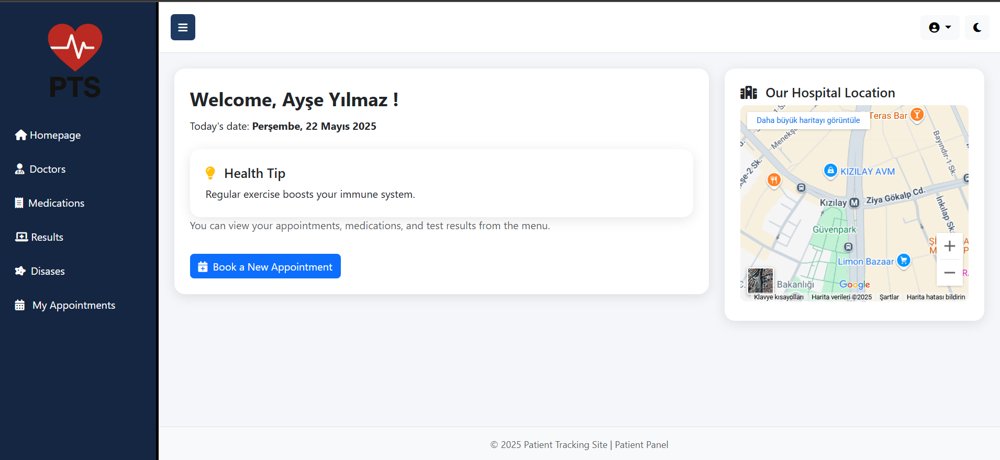
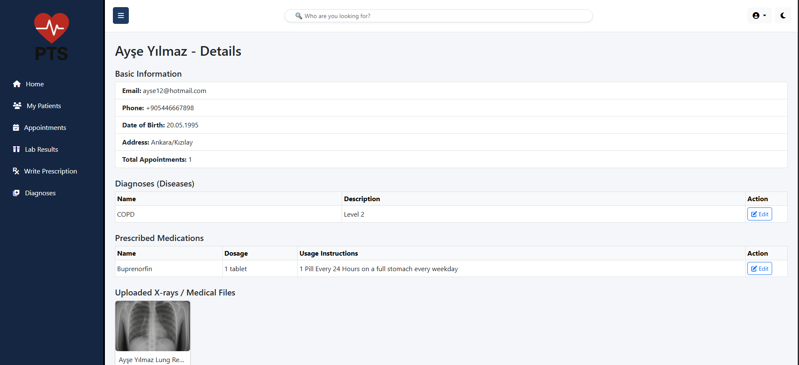

# 🏥 Patient Tracking Site

A web-based hospital management system where patients can register, log in, view their prescriptions, lab results, and book appointments with doctors based on specialization and doctors can manage their patients.

## 🚀 Features

- 👤 Patient registration and login system
- 🔐 Password update with validation
- 📷 Profile photo upload and gender-based default avatar
- 🧾 View prescribed medications with doctor details
- 📁 View uploaded lab results (PDFs or other files)
- 📅 Appointment booking system (choose specialization ➝ select doctor ➝ set date/time)
- 🩺 Doctor listing with specialization and contact info
- 🌓 Fully responsive dark mode toggle
- 📄 Role-based interface and session management
- 🌍 Localized design (Turkish + English labels)

## 🛠️ Technologies Used

- **ASP.NET Core MVC 8.0**
- **Entity Framework Core** (Code First Approach)
- **SQL Server** – Database
- **Bootstrap 5.3** – UI and responsive design
- **jQuery & AJAX** – Dynamic doctor loading in appointments
- **Session Management** – Login and authorization
- **LINQ** – Data queries
- **HTML5, CSS3, JavaScript**

## 📷 Screenshots

### 🔐 Login Page

### 👨‍⚕️ Doctor List

### 📅 Doctor Homepage

### 📅 Patient Homepage

### 📅 List the Patient

👤 Developers
-Nebi Erdenay Çubukçu 
-Mehmet Tat

